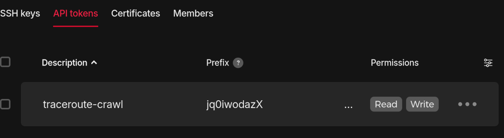
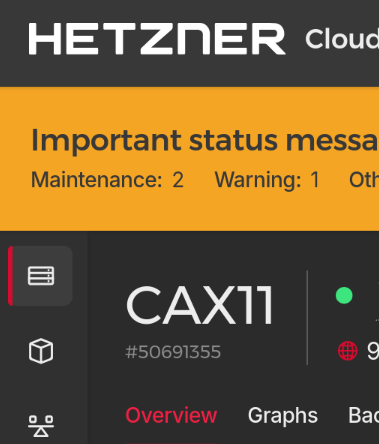
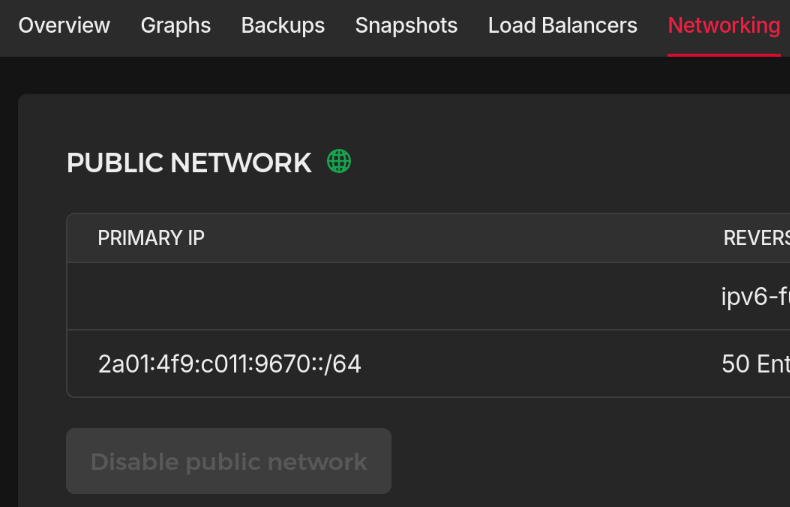

# IPv6 Traceroute Crawl
Make your own "[traceroute
crawl](https://www.theregister.com/2013/02/15/star_wars_traceroute/)" using the
IPv6 prefix assigned to your Hetzner server.

```
$ traceroute -I -m 128 episode-iv.dev.snart.me
traceroute to episode-iv.dev.snart.me (2a01:4f9:c011:9670::ffff), 128 hops max, 80 byte packets
26  * * *
29  a.long.time.ago.in.a.galaxy.far.far.away (2a01:4f9:c011:9670::1)  328.064 ms  328.062 ms  328.027 ms
30  star.wars (2a01:4f9:c011:9670::2)  314.037 ms  314.042 ms  314.041 ms
31  episode.iv (2a01:4f9:c011:9670::3)  319.848 ms  319.840 ms  319.829 ms
32  a.new.hope (2a01:4f9:c011:9670::4)  318.369 ms  318.253 ms  318.253 ms
33  it.is.a.period.of.civil.war (2a01:4f9:c011:9670::5)  327.944 ms  327.577 ms  327.573 ms
34  rebel.spaceships.striking (2a01:4f9:c011:9670::6)  312.831 ms  312.584 ms  312.581 ms
35  from.a.hidden.base.have.won (2a01:4f9:c011:9670::7)  327.412 ms  327.391 ms  327.393 ms
36  their.first.victory.against (2a01:4f9:c011:9670::8)  318.734 ms  318.262 ms  318.105 ms
37  the.evil.galactic.empire (2a01:4f9:c011:9670::9)  327.210 ms  327.219 ms  326.984 ms
38  during.the.battle.rebel (2a01:4f9:c011:9670::a)  318.176 ms  318.379 ms  318.374 ms
39  spies.managed.to.steal.secret (2a01:4f9:c011:9670::b)  328.010 ms  327.643 ms  327.451 ms
40  plans.to.the.empires (2a01:4f9:c011:9670::c)  318.623 ms  318.625 ms  318.327 ms
41  ultimate.weapon.the.death (2a01:4f9:c011:9670::d)  312.965 ms  312.415 ms  312.509 ms
42  star.an.armored.space (2a01:4f9:c011:9670::e)  318.614 ms  318.374 ms  318.154 ms
43  station.with.enough.power.to (2a01:4f9:c011:9670::f)  326.995 ms  326.953 ms  326.799 ms
44  destroy.an.entire.planet (2a01:4f9:c011:9670::10)  313.987 ms  313.739 ms  313.483 ms
45  pursued.by.the.empires (2a01:4f9:c011:9670::11)  328.145 ms  327.666 ms  327.553 ms
46  sinister.agents.princess (2a01:4f9:c011:9670::12)  313.836 ms  313.668 ms  313.658 ms
47  leia.races.home.aboard.her (2a01:4f9:c011:9670::13)  313.014 ms  312.732 ms  312.679 ms
48  starship.custodian.of.the (2a01:4f9:c011:9670::14)  313.077 ms  312.779 ms  312.538 ms
49  stolen.plans.that.can.save (2a01:4f9:c011:9670::15)  326.953 ms  327.368 ms  326.788 ms
50  her.people.and.restore (2a01:4f9:c011:9670::16)  328.323 ms  328.103 ms  327.992 ms
51  freedom.to.the.galaxy (2a01:4f9:c011:9670::17)  329.054 ms  329.055 ms  327.833 ms
52  l.xxxxxxxxxxxxxxxxxxx.l (2a01:4f9:c011:9670::18)  314.176 ms  313.980 ms  314.123 ms
53  l.xxxxxxxxxxxxxxxxxx.l (2a01:4f9:c011:9670::19)  328.055 ms  327.947 ms  327.922 ms
54  l.xxxxxxxxxxxxxxxxx.l (2a01:4f9:c011:9670::1a)  314.308 ms  314.384 ms  314.231 ms
55  l.xxxxxxxxxxxxxxxx.l (2a01:4f9:c011:9670::1b)  313.088 ms  312.625 ms  312.704 ms
56  l.xxxxxxxxxxxxxxx.l (2a01:4f9:c011:9670::1c)  316.147 ms  314.784 ms  314.780 ms
57  l.xxxxxxxxxxxxxx.l (2a01:4f9:c011:9670::1d)  327.134 ms  327.321 ms  326.969 ms
58  l.xxxxxxxxxxxxx.l (2a01:4f9:c011:9670::1e)  314.810 ms  314.984 ms  315.035 ms
59  l.xxxxxxxxxxxx.l (2a01:4f9:c011:9670::1f)  319.897 ms  318.836 ms  318.705 ms
60  l.xxxxxxxxxxx.l (2a01:4f9:c011:9670::20)  318.683 ms  318.677 ms  318.675 ms
61  l.xxxxxxxxxx.l (2a01:4f9:c011:9670::21)  318.610 ms  318.498 ms  318.335 ms
62  l.xxxxxxxxx.l (2a01:4f9:c011:9670::22)  313.292 ms  313.285 ms  313.283 ms
63  l.xxxxxxxx.l (2a01:4f9:c011:9670::23)  328.846 ms  328.842 ms  329.196 ms
64  l.xxxxxxx.l (2a01:4f9:c011:9670::24)  330.069 ms  330.071 ms  330.071 ms
65  l.xxxxxx.l (2a01:4f9:c011:9670::25)  320.653 ms  320.655 ms  320.653 ms
66  l.xxxxx.l (2a01:4f9:c011:9670::26)  320.670 ms  320.657 ms  320.485 ms
67  l.xxxx.l (2a01:4f9:c011:9670::27)  328.765 ms  327.238 ms  327.235 ms
68  l.xxx.l (2a01:4f9:c011:9670::28)  327.857 ms  327.546 ms  327.539 ms
69  l.xx.l (2a01:4f9:c011:9670::29)  314.867 ms  314.877 ms  314.876 ms
70  l.x.l (2a01:4f9:c011:9670::2a)  328.112 ms  327.195 ms  327.167 ms
71  l.l (2a01:4f9:c011:9670::2b)  313.568 ms  313.565 ms  313.561 ms
72  x.x (2a01:4f9:c011:9670::2c)  319.367 ms  319.375 ms  319.443 ms
73  by.david.timber (2a01:4f9:c011:9670::2d)  313.790 ms  313.793 ms  313.506 ms
74  dxdt.at.dev.snart.me (2a01:4f9:c011:9670::2e)  313.742 ms  313.746 ms  313.750 ms
75  tribute.to.ipv6.deployment (2a01:4f9:c011:9670::2f)  327.868 ms  327.920 ms  327.905 ms
76  episode-iv.dev.snart.me (2a01:4f9:c011:9670::ffff)  328.742 ms  327.805 ms  327.800 ms
```

## PREREQUISITES
- A Hetzner server with ...
  - Systemd
  - Kernel build with network namespace support(most distros have this)
  - IPv6 public network
- The Hetzner API token to modify the server from the script

## INSTALL
```sh
dnf install curl tar gzip jq ipcalc

curl -L https://github.com/dxdxdt/traceroute-crawl/archive/refs/tags/r1.tar.gz > traceroute-crawl-r1.tar.gz
tar xf traceroute-crawl-r1.tar.gz
cd traceroute-crawl-r1

sudo make install
```

Edit `/etc/traceroute-crawl/traceroute-crawl.conf`.


`AUTH_TOKEN`: the API token from the project security page.



`SERVER`: the server number on the overview page



`PREFIX`: from the server networking page



Edit the rest to your liking. Once all set, use the following command to add PTR
records.

```sh
# Add the records. Takes a while
traceroute-crawl add
# After seeing "OK", wait a few minutes for the records to propagate.
# To test the records, use
traceroute-crawl dig
```

Test the netns set up.

```sh
# Create and set up netns
traceroute-crawl mkns

# Check the set up
ip netns
ip -6 route
sudo ip -n ns-0001 -6 addr
sudo ip -n ns-0001 -6 route
# ...
traceroute -I -m 255 2001:db8:574f:4567:abcd::ffff # replace with your $TAIL_ADDR

# Delete all netns
#  (so that the Systemd service can manage them)
traceroute-crawl mkns
```

If everything looks all good, enable and start the service:

```sh
systemctl enable --now traceroute-crawl.service
```

## UNINSTALL
```sh
# Delete all PTR records matching PREFIX/CIDR
# WARNING: PREFIX and CIDR must be set correctly or it could end up deleting all
#  of the records!!!
traceroute-crawl purge

# Stop and disable the service
systemctl disable --now traceroute-crawl

# Remove the executables
sudo make uninstall
```

## Tips
You may use the instanced systemd service `traceroute-crawl@.service` to have
multiple instances. Just make sure you use different `PREFIX` for each
instances.
